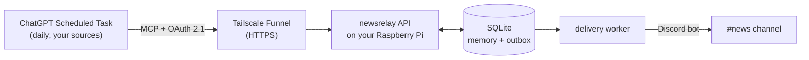

<div align="center">

# 🗞️ newsdesk-mcp

**Your own curated news channel: ChatGPT researches, a Raspberry Pi remembers, Discord delivers.**

<sub>Self-hosted MCP server · AI news digest for Discord · ChatGPT Scheduled Tasks · news deduplication with long-term memory · Raspberry Pi</sub>

[](https://github.com/Oniichan187/newsdesk-mcp/actions/workflows/ci.yml)
[](LICENSE)


</div>

A ChatGPT **Scheduled Task** reads the news sources *you* choose every day and writes short, sourced
summaries. Before posting, it asks this self-hosted **MCP server** "have we covered this already?" —
the server matches candidates against a compact long-term memory on your Pi and returns only what is
relevant, so ChatGPT posts **only genuinely new stories and real updates**, never the same story twice.
The server then delivers the posts reliably to a **Discord channel** through a bot.

No LLM on the Pi, no crawler, no Docker, no cloud database: Python + SQLite + systemd, ~100 MB RAM.

> **In one sentence:** a daily, AI-written news briefing in your Discord server that **never repeats a
> story**, posts **follow-ups only when something materially changed**, cites **only outlets you allow**,
> and runs unattended on a Raspberry Pi — with ChatGPT doing the research and a small MCP server doing
> the remembering.

```
## 🔄 Update: Austrian health insurer confirms data breach
-# 🛡️ Cybersecurity · 04 Oct 2026

**Since the last update:** The insurer has now officially confirmed the breach first claimed by a
hacker group on Thursday.

**Why it matters:** Data of about 1.2 million insured people is affected …

**Key facts:**
- Confirmation came from the insurer's own statement
- Police and the data protection authority are investigating

**Confirmed / unclear:** The breach is confirmed; whether medical records were taken is still open.

📰 Sources: [ORF](…) · [Der Standard](…)
```
<sub>Illustrative example.</sub>

## 🆚 How is this different from an RSS-to-Discord AI bot?

Most "AI news bots" fetch RSS headlines, let an LLM rewrite them and post them. That works, but they
forget what they posted after a few days, repeat stories that ten outlets cover, and cannot tell a
rehash from a real development. newsdesk-mcp is built around exactly that problem:

| | Typical RSS + LLM bot | **newsdesk-mcp** |
|---|---|---|
| Who finds the news | RSS feeds | ChatGPT researches the web across your chosen outlets, can verify with primary sources |
| Duplicate detection | same URL/title, last few days | long-term memory: URL, fact fingerprints, full-text search, fuzzy matching — for years |
| Same story from 10 outlets | 10 posts (or 1 by luck) | 1 post |
| Follow-ups | reposted as "new" or dropped | posted as **Update** only when facts materially changed; **Corrections** supported |
| Sources | whatever the feed contains | enforced **allowlist** of outlets (lookalike domains rejected) |
| Missed days / outages | gap or flood | gap-free catch-up in bounded windows |
| Delivery | fire-and-forget | durable outbox, retries, no double posts, never pings @everyone |
| Token use | full articles to the LLM | compact candidates; history is matched locally, never sent |
| Costs | API tokens per run | covered by your ChatGPT plan (no API key needed) |

When a simple RSS bot is enough for you, use one — it is easier to set up. Use this when you want a
**curated, non-repetitive, sourced** briefing that keeps track of ongoing stories.

## ✨ Features

- **Long-term news memory** — layered local duplicate detection (canonical URLs, fact fingerprints,
  FTS5, fuzzy matching) that tells *duplicates* from *material updates* and *corrections*; old topics
  stay findable for years without ever sending history to ChatGPT.
- **Token-efficient** — ChatGPT sends compact candidates and gets back only the few relevant matches.
- **Never misses a day** — research checkpoints; after an outage the gap is caught up in bounded
  windows, nothing is skipped silently.
- **Reliable Discord delivery** — durable outbox, rate-limit aware, ordered, nonce-based safe retries;
  nothing is lost when Discord or the internet is down; never pings anyone. The bot shows as
  **online** ("Watching the news") whenever the Pi runs.
- **Secure by default** — OAuth 2.1 (PKCE, DCR, RFC 9207), strict input validation, no arbitrary
  HTTP, secrets as systemd credentials, hardened units (`systemd-analyze security` ≈ 1.1).
- **Set and forget** — watchdogs, health timer, verified backups, integrity checks, retention,
  safe upgrades with automatic rollback.
- **Only the sources you allow** — an enforced allowlist of outlets; language, region and topics of
  the posts are set with one command.

## 🧭 How it works



Each run: `begin_run` (time window) → research → `match_candidates` (local dedup) → exactly one
`publish_digest` *or* `complete_noop`. Details: [ARCHITECTURE.md](docs/ARCHITECTURE.md).

## 🚀 Quick start

**You need:** a Raspberry Pi (or any Debian/Ubuntu box) with Python ≥ 3.11 and systemd, a
[Tailscale](https://tailscale.com) account with [Funnel](https://tailscale.com/kb/1223/funnel)
enabled, a Discord server, and a ChatGPT plan with **developer mode / custom apps** (see
[known limitations](#%EF%B8%8F-known-limitations)).

```sh
# 1. on the Pi
git clone https://github.com/Oniichan187/newsdesk-mcp.git && cd newsdesk-mcp
sudo sh scripts/install.sh            # idempotent; creates user, venv, DB, systemd units
sudo sh scripts/expose-funnel.sh      # public HTTPS URL via Tailscale Funnel

# 2. Discord: create an application + bot (Developer Portal), invite it with
#    "View Channel" + "Send Messages", copy the channel id (Developer Mode → right-click channel)
sudo newsrelay set-bot-token          # paste the token (hidden input)
sudoedit /etc/newsrelay/config.toml   # discord_channel_id = "123…"
sudo systemctl restart newsrelay-worker
sudo newsrelay test-discord           # posts a test message and deletes it again

# 3. the passphrase you need when connecting ChatGPT
sudo cat /etc/newsrelay/secrets/owner_passphrase.txt
```

4. **Connect ChatGPT** — Settings → Apps → Advanced settings → Developer mode → *Create app*, URL
   `https://<your-pi>.<your-tailnet>.ts.net/mcp`, authentication **OAuth**, approve with the
   passphrase. Step by step: [CHATGPT_SETUP.md](docs/CHATGPT_SETUP.md).
5. **Create the task** — paste [the default prompt](docs/SCHEDULED_TASK_PROMPT.md) (daily 18:00) or
   build your own (next section).

## 🎛️ Make it yours

**Sources** — the outlets that may be used are an allowlist in
[`src/newsrelay/sources.toml`](src/newsrelay/sources.toml): 30 German-language quality outlets, public
broadcasters and independent newsrooms from Germany, Austria and Switzerland (taz, Die Zeit,
Süddeutsche, Der Spiegel, Der Standard, ORF, Tagesschau, Deutschlandfunk, Republik, netzpolitik.org,
Correctiv, ...). The relay **rejects every other source URL**, and the prompt builder lists exactly
these outlets. Edit the file to use your own.

<details>
<summary><b>The 30 allowed outlets</b> (from <code>sources.toml</code>)</summary>

| Group | Outlets |
|---|---|
| Germany: newspapers & magazines | [taz](https://taz.de) · [Frankfurter Rundschau](https://fr.de) · [Die Zeit](https://zeit.de) · [Süddeutsche Zeitung](https://sueddeutsche.de) · [Der Spiegel](https://spiegel.de) · [Tagesspiegel](https://tagesspiegel.de) |
| Germany: public broadcasting | [Tagesschau](https://tagesschau.de) · [Deutschlandfunk](https://deutschlandfunk.de) · [ZDF](https://zdf.de) · [ARD](https://ard.de) · [NDR](https://ndr.de) |
| Germany: independent, investigative, media criticism | [netzpolitik.org](https://netzpolitik.org) · [Correctiv](https://correctiv.org) · [FragDenStaat](https://fragdenstaat.de) · [Volksverpetzer](https://volksverpetzer.de) · [Übermedien](https://uebermedien.de) · [Belltower.News](https://belltower.news) · [Krautreporter](https://krautreporter.de) |
| Austria | [Der Standard](https://derstandard.at) · [ORF](https://orf.at) · [Falter](https://falter.at) · [Profil](https://profil.at) · [Dossier](https://dossier.at) · [ZackZack](https://zackzack.at) |
| Switzerland | [Tages-Anzeiger](https://tagesanzeiger.ch) · [Berner Zeitung](https://bernerzeitung.ch) · [Der Bund](https://derbund.ch) · [Republik](https://republik.ch) · [Watson](https://watson.ch) |
| Other | [zufron.com](https://zufron.com) |

</details>

**Prompt** — language, region, topics and time in one command:

```sh
python3 scripts/build_prompt.py --language German --region "Germany and the EU" --time 07:00 > my-task-prompt.md
```

Everything else (channel, layout, memory, retention): [CUSTOMIZING.md](docs/CUSTOMIZING.md).

## 🛠️ Operating it

| Command | Purpose |
|---|---|
| `sudo newsrelay status` | one-screen health: versions, API/worker, checkpoint, delivery backlog, DB size, latest backup |
| `sudo newsrelay test-discord` | send + delete a test message |
| `sudo newsrelay outbox list [--all]` | undelivered, failed and uncertain posts |
| `sudo newsrelay outbox requeue <id>` · `requeue-failed --yes` | resend after fixing Discord access |
| `sudo newsrelay outbox delivered\|resend\|cancel <id>` | resolve an uncertain delivery |
| `sudo newsrelay backup` · `restore-test [file]` | verified backup / restore rehearsal |
| `sudo newsrelay revoke-tokens` | log ChatGPT out (re-authorize afterwards) |
| `sudo sh scripts/update.sh` | upgrade from a checkout (migration rehearsal + automatic rollback) |

Recovery playbooks: [DISASTER_RECOVERY.md](docs/DISASTER_RECOVERY.md).

## ⚠️ Known limitations

- **ChatGPT approvals.** OpenAI treats tools that change data as *write actions*, which may require
  confirmation; a Scheduled Task then pauses until you approve. This project needs exactly **one**
  write call per run. Whether your plan runs it fully unattended is up to OpenAI — see
  [CHATGPT_SETUP.md](docs/CHATGPT_SETUP.md).
- **Exactly-once delivery** is impossible over HTTP in general; ambiguous sends are retried only with
  Discord's nonce de-duplication and otherwise parked for a decision, never blindly re-posted.
- **Backups are local** (same SD card). Copy `/var/lib/newsrelay/backups` elsewhere now and then.

## ❓ FAQ

**How do I get a daily AI news summary posted to my Discord server automatically?**
Run this MCP server on a Raspberry Pi (or any Linux box), connect it to ChatGPT as a custom app, and
create a ChatGPT Scheduled Task with the [provided prompt](docs/SCHEDULED_TASK_PROMPT.md). Every day the
task researches the news and publishes through the server's Discord bot.

**How do I stop ChatGPT (or any AI news bot) from posting the same news again and again?**
That is the core of this project: before publishing, ChatGPT sends compact candidates to the server,
which answers `EXACT_DUPLICATE`, `LIKELY_DUPLICATE`, `POSSIBLE_EXISTING_TOPIC` (with the previous facts)
or `NO_MATCH`, using a local long-term memory. The server also re-checks duplicates when publishing.

**Can ChatGPT Scheduled Tasks use a custom MCP server?**
ChatGPT supports custom MCP servers as apps in developer mode, and Scheduled Tasks can use apps.
Write actions may require your approval depending on your plan; this project needs exactly one write
call per run. See [CHATGPT_SETUP.md](docs/CHATGPT_SETUP.md) for the current details and limitations.

**Does the Raspberry Pi run an AI model?**
No. The Pi only stores memory, matches candidates and delivers to Discord (~100 MB RAM). The research
and writing happen in ChatGPT.

**Can I use other news sources, another language or region?**
Yes. Edit the allowlist in [`src/newsrelay/sources.toml`](src/newsrelay/sources.toml) and regenerate the
prompt with `scripts/build_prompt.py --language … --region … --time …` — see
[CUSTOMIZING.md](docs/CUSTOMIZING.md).

**Is it safe to expose a server to the internet for ChatGPT?**
The endpoint requires OAuth 2.1 (PKCE), accepts only strictly validated news metadata, never fetches
URLs, cannot run commands, and holds no secrets it could return. See [SECURITY.md](docs/SECURITY.md).

**Does it work with Telegram, Slack or email?**
Not out of the box — delivery is Discord (bot or webhook). The transport is a small isolated module
(`publishing/discord.py`); other targets are welcome as contributions.

## 📚 Documentation

| | |
|---|---|
| [ARCHITECTURE](docs/ARCHITECTURE.md) | components, run lifecycle, state machines, upgrades |
| [CHATGPT_SETUP](docs/CHATGPT_SETUP.md) | connecting ChatGPT, OAuth details, OpenAI limitations |
| [SCHEDULED_TASK_PROMPT](docs/SCHEDULED_TASK_PROMPT.md) | the ready-to-paste default prompt |
| [CUSTOMIZING](docs/CUSTOMIZING.md) | sources, language, Discord, memory, retention |
| [SECURITY](docs/SECURITY.md) | threat model, exposure, secrets, dependencies |
| [DISASTER_RECOVERY](docs/DISASTER_RECOVERY.md) | corrupted DB, lost SD card, revoked token, broken update |
| [VERIFICATION](docs/VERIFICATION.md) | what was tested on real hardware |
| [CHANGELOG](CHANGELOG.md) | release history |

## 🧪 Development

```sh
python3 -m venv .venv
PIP_CONFIG_FILE=/dev/null .venv/bin/pip install --require-hashes -r requirements.lock -r requirements-dev.lock
echo "$PWD/src" > "$(.venv/bin/python -c 'import sysconfig;print(sysconfig.get_paths()["purelib"])')/newsrelay.pth"
.venv/bin/pytest -q && .venv/bin/ruff check . && .venv/bin/mypy
```

Dependencies are pinned with hashes (`scripts/lock.sh`, pip-tools, PyPI only). Contributions welcome —
see [CONTRIBUTING.md](CONTRIBUTING.md).

## 📄 License

[MIT](LICENSE). News content belongs to the respective publishers; the bot posts short summaries with
links to the original articles.
